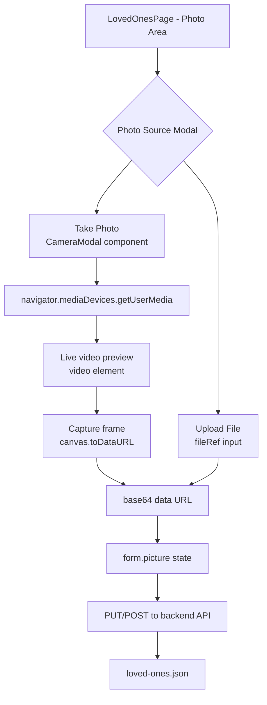
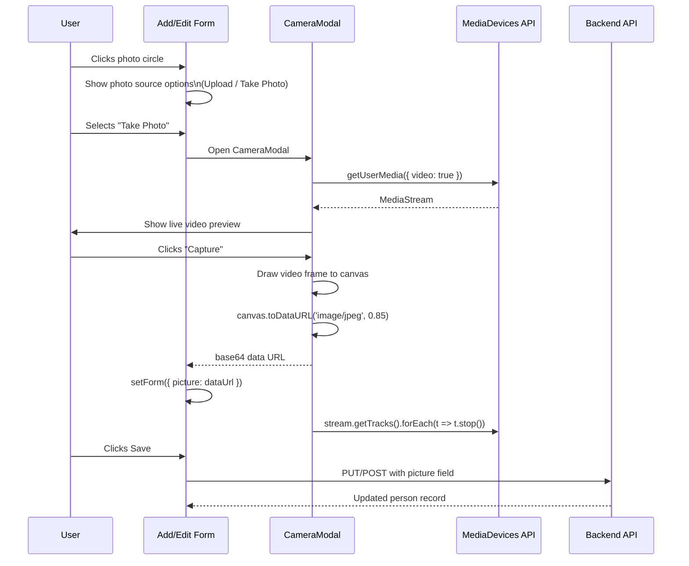
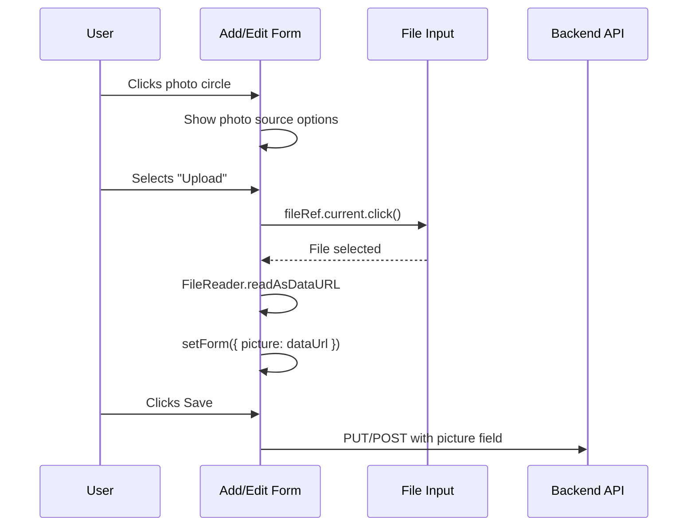

# Design Document: Loved Ones Take Photo

## Overview

This feature adds a "Take Photo" option to the family member photo upload flow on the Loved Ones page. When a user opens the add/edit form for a family member, they can either upload an existing image file or capture a new photo directly from their device camera — all within the Electron app using the browser's `MediaDevices` API.

The app is an Electron desktop app (React + TypeScript frontend, Node.js backend). Camera access is already partially enabled in `electron/main.js` via `setPermissionRequestHandler` granting `media` permissions. The photo is stored as a base64 data URL in `backend/data/loved-ones.json`, the same format used by the existing file upload path.

## Architecture



## Sequence Diagrams

### Take Photo Flow



### Upload File Flow (existing, unchanged)



## Components and Interfaces

### Modified: LovedOnesPage photo area

The existing photo circle (72×72 dashed circle) currently calls `fileRef.current?.click()` directly on click. This will be changed to show a small inline option picker (two buttons: "Upload" and "Take Photo") instead of immediately opening the file dialog.

**New state added to `LovedOnesPage`:**
```typescript
const [showPhotoOptions, setShowPhotoOptions] = useState(false)
const [showCamera, setShowCamera] = useState(false)
```

**Updated photo area interaction:**
```typescript
// Photo circle onClick → toggle showPhotoOptions
// "Upload" button → fileRef.current?.click(); setShowPhotoOptions(false)
// "Take Photo" button → setShowCamera(true); setShowPhotoOptions(false)
```

### New: CameraModal component

A self-contained modal component that handles the full camera lifecycle.

**Interface:**
```typescript
interface CameraModalProps {
  onCapture: (dataUrl: string) => void
  onClose: () => void
}
```

**Responsibilities:**
- Request camera access via `navigator.mediaDevices.getUserMedia`
- Render a live `<video>` preview
- On "Capture": draw current video frame to an offscreen `<canvas>`, call `canvas.toDataURL('image/jpeg', 0.85)`, pass result to `onCapture`
- On close/cancel: stop all media tracks to release the camera
- Handle permission denied / no camera errors gracefully with a user-facing message

## Data Models

No changes to the data model. The `picture` field on `Person` remains `string | null` (base64 data URL or null). A JPEG-encoded capture at 0.85 quality produces a data URL of the same shape as the existing file upload path.

```typescript
interface Person {
  id: string
  name: string
  relationship: string
  customRelationship?: string
  contactSite: string
  contactURL?: string
  picture: string | null   // unchanged — base64 data URL
  memories: string
  parentIds: string[]
}
```

## Key Functions with Formal Specifications

### CameraModal: startCamera()

```typescript
async function startCamera(): Promise<void>
```

**Preconditions:**
- `navigator.mediaDevices` is available (Electron Chromium context)
- Component is mounted

**Postconditions:**
- `videoRef.current.srcObject` is set to a live `MediaStream`
- `streamRef.current` holds the stream for later cleanup
- On failure: `error` state is set to a human-readable message; no stream is held

**Error cases:**
- `NotAllowedError` → "Camera permission was denied."
- `NotFoundError` → "No camera found on this device."
- Any other error → "Could not access camera."

### CameraModal: capture()

```typescript
function capture(): void
```

**Preconditions:**
- `videoRef.current` has an active video stream (`readyState >= HAVE_CURRENT_DATA`)
- `videoRef.current.videoWidth > 0`

**Postconditions:**
- An offscreen canvas is created with dimensions matching the video feed
- The current video frame is drawn to the canvas
- `canvas.toDataURL('image/jpeg', 0.85)` is called
- `onCapture(dataUrl)` is invoked with the resulting string
- Camera stream is stopped

**Loop Invariants:** N/A (no loops)

### CameraModal: stopCamera()

```typescript
function stopCamera(): void
```

**Preconditions:**
- May be called at any time (idempotent)

**Postconditions:**
- All tracks in `streamRef.current` are stopped
- `streamRef.current` is set to null
- Camera hardware is released

## Algorithmic Pseudocode

### Main Camera Capture Algorithm

```pascal
PROCEDURE capturePhoto(videoEl, onCapture)
  INPUT: videoEl — HTMLVideoElement with active stream
         onCapture — callback(dataUrl: string)
  OUTPUT: side-effect: calls onCapture with JPEG data URL

  SEQUENCE
    IF videoEl.videoWidth = 0 THEN
      RETURN  // video not ready yet
    END IF

    canvas ← createElement("canvas")
    canvas.width  ← videoEl.videoWidth
    canvas.height ← videoEl.videoHeight

    ctx ← canvas.getContext("2d")
    ctx.drawImage(videoEl, 0, 0)

    dataUrl ← canvas.toDataURL("image/jpeg", 0.85)

    stopCamera()
    onCapture(dataUrl)
  END SEQUENCE
END PROCEDURE
```

### Camera Lifecycle Algorithm

```pascal
PROCEDURE startCamera(videoEl, streamRef, setError)
  INPUT: videoEl — HTMLVideoElement ref
         streamRef — mutable ref to hold MediaStream
         setError — state setter for error message

  SEQUENCE
    TRY
      stream ← AWAIT navigator.mediaDevices.getUserMedia({ video: true, audio: false })
      streamRef.current ← stream
      videoEl.srcObject ← stream
      AWAIT videoEl.play()
    CATCH error
      IF error.name = "NotAllowedError" THEN
        setError("Camera permission was denied.")
      ELSE IF error.name = "NotFoundError" THEN
        setError("No camera found on this device.")
      ELSE
        setError("Could not access camera.")
      END IF
    END TRY
  END SEQUENCE
END PROCEDURE

PROCEDURE stopCamera(streamRef)
  INPUT: streamRef — mutable ref holding MediaStream or null

  SEQUENCE
    IF streamRef.current IS NOT NULL THEN
      FOR each track IN streamRef.current.getTracks() DO
        track.stop()
      END FOR
      streamRef.current ← null
    END IF
  END SEQUENCE
END PROCEDURE
```

## Example Usage

```typescript
// Inside LovedOnesPage form JSX:
{showCamera && (
  <CameraModal
    onCapture={(dataUrl) => {
      setForm(f => ({ ...f, picture: dataUrl }))
      setShowCamera(false)
    }}
    onClose={() => setShowCamera(false)}
  />
)}

// Photo source picker (shown when photo circle is clicked):
{showPhotoOptions && (
  <div style={photoOptionsStyle}>
    <button onClick={() => { fileRef.current?.click(); setShowPhotoOptions(false) }}>
      Upload photo
    </button>
    <button onClick={() => { setShowCamera(true); setShowPhotoOptions(false) }}>
      Take photo
    </button>
  </div>
)}
```

## Error Handling

### Permission Denied

**Condition:** User denies camera access or Electron permission handler blocks it.
**Response:** `CameraModal` displays an inline error message: "Camera permission was denied." with a Close button.
**Recovery:** User can dismiss and use the Upload option instead.

### No Camera Device

**Condition:** `getUserMedia` throws `NotFoundError` (no webcam attached).
**Response:** `CameraModal` displays "No camera found on this device."
**Recovery:** User can dismiss and use the Upload option instead.

### Video Not Ready on Capture

**Condition:** User clicks Capture before the video stream has loaded frames (`videoWidth === 0`).
**Response:** Capture is a no-op (guard clause returns early). The button can be disabled until `videoWidth > 0` via an `onLoadedMetadata` event handler.
**Recovery:** User waits for preview to appear, then captures.

### Stream Leak on Unmount

**Condition:** Component unmounts (e.g. user closes form) while camera is active.
**Response:** `useEffect` cleanup calls `stopCamera()` to release hardware.
**Recovery:** Automatic — no user action needed.

## Testing Strategy

### Unit Testing Approach

- Test `capture()` logic with a mocked `HTMLVideoElement` (set `videoWidth`/`videoHeight`, mock `getContext`)
- Test `stopCamera()` is idempotent when `streamRef.current` is null
- Test error state is set correctly for each `getUserMedia` rejection type

### Property-Based Testing Approach

**Property Test Library:** fast-check

- For any valid JPEG quality value `q ∈ [0, 1]`, `canvas.toDataURL('image/jpeg', q)` returns a string starting with `data:image/jpeg;base64,`
- For any video dimensions `(w, h)` where `w > 0 && h > 0`, the canvas is created with matching dimensions

### Integration Testing Approach

- In Electron's test environment, mock `navigator.mediaDevices.getUserMedia` to return a synthetic stream
- Verify that after `onCapture` is called, `form.picture` in `LovedOnesPage` is updated to the returned data URL
- Verify the camera stream is stopped after capture and after modal close

## Performance Considerations

- JPEG at 0.85 quality keeps file size reasonable for storage in JSON. A typical 1280×720 webcam frame encodes to ~80–150 KB as base64, comparable to a compressed photo upload.
- The canvas is created in memory and immediately discarded after `toDataURL` — no persistent DOM node.
- Camera stream is stopped immediately after capture to free hardware resources.

## Security Considerations

- `getUserMedia` is only called on explicit user action (clicking "Take Photo"), never on page load.
- Electron's `setPermissionRequestHandler` already grants `media` permission; no additional IPC bridge is needed.
- The captured image never leaves the local machine — it is stored as a data URL in the local JSON file via the existing backend API, same as uploaded photos.
- No audio is requested: `getUserMedia({ video: true, audio: false })`.

## Dependencies

- `navigator.mediaDevices.getUserMedia` — available in Electron's Chromium renderer (no additional packages needed)
- Existing `fileRef` / `handlePicture` / `form.picture` state in `LovedOnesPage` — reused unchanged
- No new npm packages required

## Correctness Properties

*A property is a characteristic or behavior that should hold true across all valid executions of a system — essentially, a formal statement about what the system should do. Properties serve as the bridge between human-readable specifications and machine-verifiable correctness guarantees.*

### Property 1: PhotoSourcePicker always shows both options

*For any* state of the add/edit form, clicking the photo circle should always render a PhotoSourcePicker containing both an "Upload" button and a "Take Photo" button.

**Validates: Requirements 1.1**

### Property 2: getUserMedia is always called with video-only constraints

*For any* CameraModal instantiation, when the modal opens it should call `navigator.mediaDevices.getUserMedia` with `{ video: true, audio: false }` — never requesting audio.

**Validates: Requirements 2.1**

### Property 3: Video srcObject is set to the returned stream

*For any* MediaStream returned by `getUserMedia`, the CameraModal's video element's `srcObject` should be set to that exact stream object.

**Validates: Requirements 2.2**

### Property 4: Canvas dimensions match video dimensions

*For any* video element with `videoWidth > 0` and `videoHeight > 0`, the offscreen canvas created during capture should have `width === videoWidth` and `height === videoHeight`.

**Validates: Requirements 3.1**

### Property 5: Capture always produces a JPEG data URL

*For any* valid video dimensions `(w, h)` where `w > 0` and `h > 0`, calling `canvas.toDataURL('image/jpeg', 0.85)` should return a string that starts with `data:image/jpeg;base64,`.

**Validates: Requirements 3.2**

### Property 6: onCapture receives the exact data URL from the canvas

*For any* video frame captured, the string passed to the `onCapture` callback should be identical to the string returned by `canvas.toDataURL('image/jpeg', 0.85)`.

**Validates: Requirements 3.3**

### Property 7: form.picture round-trip after capture

*For any* data URL string passed to the `onCapture` callback, the `form.picture` state in `LovedOnesPage` should equal that exact string after the callback completes.

**Validates: Requirements 3.4, 6.1**

### Property 8: Camera stream is always stopped when CameraModal exits

*For any* active MediaStream held by CameraModal, all tracks in that stream should be stopped — whether the modal exits via capture, cancel, close button, or unmount.

**Validates: Requirements 3.5, 4.1, 4.2**

### Property 9: stopCamera is idempotent

*For any* number of calls to `stopCamera`, calling it when no stream is held (or after it has already been called) should complete without error and leave `streamRef.current` as null.

**Validates: Requirements 4.3, 4.4**

### Property 10: Unknown getUserMedia errors show fallback message

*For any* error thrown by `getUserMedia` whose `name` is neither `"NotAllowedError"` nor `"NotFoundError"`, the CameraModal should display "Could not access camera." and hold no stream reference.

**Validates: Requirements 5.3, 5.5**

### Property 11: No stream is held after any getUserMedia error

*For any* error thrown by `getUserMedia`, the CameraModal's internal stream reference should be null after the error is handled.

**Validates: Requirements 5.5**

### Property 12: Saved form always includes picture data URL in request body

*For any* data URL set in `form.picture` (whether from camera capture or file upload), the PUT or POST request body sent to the Backend_API should contain that exact value in the `picture` field.

**Validates: Requirements 6.1, 6.2**

### Property 13: File upload round-trip preserves data URL

*For any* file read via `FileReader.readAsDataURL`, the resulting data URL should be set as `form.picture` unchanged, identical to pre-feature behavior.

**Validates: Requirements 7.2**
