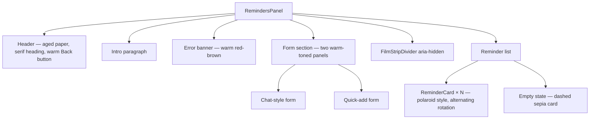

# Design Document: Reminders Nostalgic Redesign

## Overview

This feature is a pure visual redesign of `src/app/RemindersPanel.tsx`. All existing logic — API calls, state management, form handling, and ARIA attributes — is preserved verbatim. Only the styling layer changes.

The new aesthetic is "plenkacore": warm analog film photography. The UI should feel like a physical contact sheet or photo album page, with aged paper textures, polaroid-style reminder cards, film strip dividers, sepia/cream/olive tones, and retro serif typography. No CSS framework classes are introduced; all styling uses React inline `style` objects, consistent with the rest of the project.

## Architecture

This is a single-component reskin. No new components are introduced at the application level, though the existing `RemindersPanel` will be refactored to extract two small presentational sub-components for clarity:

- `FilmStripDivider` — purely decorative divider
- `ReminderCard` — polaroid-style card for a single reminder item



## Components and Interfaces

### RemindersPanel (modified)

The top-level component. All existing state, hooks, and API logic remain unchanged. Only the JSX return value is restyled.

Key style changes:
- Root `<div>`: background switches from `#f0f7ff` to the aged-paper gradient + SVG grain overlay
- Header: `backgroundColor` changes to `rgba(245, 239, 224, 0.92)`, border color to `#c8a97e`
- All text colors shift from blue-family to warm brown / sepia family

### FilmStripDivider (new, inline in RemindersPanel file)

```typescript
function FilmStripDivider() {
  // renders a dark brown band with evenly-spaced sprocket holes
}
```

Props: none. Always `aria-hidden="true"`.

The sprocket holes are rendered as a row of small `<span>` elements (or a single `<div>` with a repeating background pattern) inside the band. Using inline `style` only.

### ReminderCard (new, inline in RemindersPanel file)

```typescript
interface ReminderCardProps {
  reminder: Reminder;
  index: number;
  onRemove: (id: string) => void;
}

function ReminderCard({ reminder, index, onRemove }: ReminderCardProps) {
  // polaroid-style card with alternating rotation
}
```

The `index` prop drives the rotation direction: even → `-1.5deg`, odd → `+1.5deg`.

## Data Models

No data model changes. The `Reminder` type is unchanged:

```typescript
type Reminder = {
  id: string;
  title: string;
  note: string | null;
  dueAt: string | null;
  createdAt: string;
  source: "voice" | "chat" | "manual";
};
```

## Style Constants

All palette values are defined as a single const object at the top of the file to avoid magic strings:

```typescript
const P = {
  cream:      "#f5efe0",
  agedWhite:  "#faf6ee",
  sepia:      "#c8a97e",
  olive:      "#7a7a4a",
  warmBrown:  "#5c3d2e",
  darkBrown:  "#3a2a1a",
  amber:      "#d4a853",
  fadedRed:   "#8b3a2a",
} as const;
```

### Background Implementation

The aged-paper background is achieved with two stacked layers on the root `<div>`:

1. A CSS radial-gradient from `#f5efe0` at center to `rgba(92, 61, 46, 0.35)` at edges
2. An SVG `<filter>` using `<feTurbulence>` (fractal noise) + `<feColorMatrix>` rendered into a pseudo-element — but since inline styles can't use pseudo-elements, the grain is implemented as an absolutely-positioned `<div>` with an inline SVG `background-image` at `opacity: 0.17`.

```typescript
// Grain overlay div — sits above background, below content
const grainStyle: React.CSSProperties = {
  position: "absolute",
  inset: 0,
  pointerEvents: "none",
  opacity: 0.17,
  backgroundImage: `url("data:image/svg+xml,%3Csvg xmlns='http://www.w3.org/2000/svg' width='200' height='200'%3E%3Cfilter id='n'%3E%3CfeTurbulence type='fractalNoise' baseFrequency='0.75' numOctaves='4' stitchTiles='stitch'/%3E%3C/filter%3E%3Crect width='200' height='200' filter='url(%23n)' opacity='1'/%3E%3C/svg%3E")`,
  backgroundRepeat: "repeat",
};
```

### Film Strip Divider Implementation

```typescript
function FilmStripDivider() {
  const holes = Array.from({ length: 18 });
  return (
    <div
      aria-hidden="true"
      style={{
        width: "100%",
        height: 34,
        backgroundColor: "#3a2a1a",
        display: "flex",
        alignItems: "center",
        justifyContent: "space-around",
        padding: "0 8px",
        margin: "32px 0",
        flexShrink: 0,
      }}
    >
      {holes.map((_, i) => (
        <span
          key={i}
          style={{
            display: "inline-block",
            width: 14,
            height: 10,
            borderRadius: 3,
            backgroundColor: "#1a0f08",
            opacity: 0.85,
          }}
        />
      ))}
    </div>
  );
}
```

### ReminderCard Implementation

```typescript
function ReminderCard({ reminder, index, onRemove }: ReminderCardProps) {
  const rotation = index % 2 === 0 ? "-1.5deg" : "1.5deg";
  const when = formatWhen(reminder.dueAt);

  return (
    <li
      style={{
        backgroundColor: "#faf6ee",
        border: "1.5px solid #c8a97e",
        boxShadow: "0 4px 14px rgba(92, 61, 46, 0.18)",
        borderRadius: 4,
        padding: "16px 16px 32px",   // thick bottom = polaroid border
        transform: `rotate(${rotation})`,
        listStyle: "none",
        display: "flex",
        flexDirection: "column",
        gap: 6,
      }}
    >
      <p style={{ fontFamily: "Georgia, 'Times New Roman', serif", fontSize: "1.05rem", color: "#5c3d2e", fontWeight: 600, margin: 0 }}>
        {reminder.title}
      </p>
      {reminder.note && (
        <p style={{ fontSize: "0.85rem", color: "#7a5c3e", margin: 0, lineHeight: 1.5 }}>
          {reminder.note}
        </p>
      )}
      <div style={{ display: "flex", flexWrap: "wrap", alignItems: "center", gap: 8, marginTop: 4 }}>
        <span style={{
          fontFamily: "'Courier New', Courier, monospace",
          fontSize: "0.7rem",
          textTransform: "uppercase",
          border: "1px solid #c8a97e",
          borderRadius: 2,
          padding: "1px 5px",
          color: "#7a7a4a",
          letterSpacing: "0.08em",
        }}>
          {sourceLabel(reminder.source)}
        </span>
        {when && (
          <span style={{ fontFamily: "'Courier New', Courier, monospace", fontSize: "0.72rem", color: "#7a5c3e" }}>
            Due {when}
          </span>
        )}
        <span style={{ fontFamily: "'Courier New', Courier, monospace", fontSize: "0.7rem", color: "#a08060" }}>
          {formatWhen(reminder.createdAt)}
        </span>
      </div>
      <button
        type="button"
        onClick={() => onRemove(reminder.id)}
        style={{
          alignSelf: "flex-end",
          background: "none",
          border: "none",
          cursor: "pointer",
          fontFamily: "'Courier New', Courier, monospace",
          fontSize: "0.75rem",
          color: "#8b3a2a",
          padding: "2px 0",
          textDecoration: "underline",
          marginTop: 4,
        }}
      >
        Remove
      </button>
    </li>
  );
}
```

## Error Handling

All existing error handling logic is preserved. Only the error banner's visual style changes:

- Previous: red border `#fecaca`, background `rgba(254, 226, 226, 0.5)`, text `text-red-900`
- New: border `rgba(139, 58, 42, 0.4)`, background `rgba(200, 100, 80, 0.15)`, text `#8b3a2a`

The `role="alert"` attribute is preserved for accessibility.

## Correctness Properties

*A property is a characteristic or behavior that should hold true across all valid executions of a system — essentially, a formal statement about what the system should do. Properties serve as the bridge between human-readable specifications and machine-verifiable correctness guarantees.*

### Property 1: Background uses correct palette and excludes old blue/white colors

*For any* render of RemindersPanel, the root container's background style should use `#f5efe0` as the base color with a radial vignette toward `rgba(92, 61, 46, 0.35)`, and the grain overlay's opacity should be between 0.12 and 0.22. None of the background-layer style objects should contain the old blue/white values (`#3b82f6`, `#93c5fd`, `#dbeafe`, `#f0f7ff`).

**Validates: Requirements 1.1, 1.2, 1.3**

### Property 2: All headings use serif font and warm brown/sepia color

*For any* render of RemindersPanel, every heading element (h1 and h2) should have a `fontFamily` containing `"Georgia"` and a `color` of either `#5c3d2e` or `#c8a97e`. The h1 `fontSize` should be at least `1.6rem` and each h2 `fontSize` at least `1.1rem`.

**Validates: Requirements 2.1, 2.2, 2.4**

### Property 3: Metadata labels use monospace font

*For any* reminder in the list, the source badge and date/time strings should be rendered with a `fontFamily` containing `"Courier New"` and a `fontSize` of at least `0.7rem`.

**Validates: Requirements 2.3**

### Property 4: Reminder card style invariants

*For any* reminder rendered as a ReminderCard, the card element should have `backgroundColor: "#faf6ee"`, a border containing `#c8a97e`, a `boxShadow` containing `rgba(92, 61, 46`, a `paddingBottom` of at least `32px` (2rem), and the title element should use the serif font family with `color: "#5c3d2e"`.

**Validates: Requirements 4.1, 4.2, 4.3**

### Property 5: Source badge is stamp-style — uppercase, monospace, no fill background

*For any* reminder source value (`"voice"`, `"chat"`, `"manual"`), the rendered source badge should have `textTransform: "uppercase"`, a `fontFamily` containing `"Courier New"`, a border color of `#c8a97e` or `#7a7a4a`, and no background fill (background is `"none"` or `"transparent"`).

**Validates: Requirements 4.4**

### Property 6: Due date is displayed in monospace when dueAt is non-null

*For any* reminder with a non-null, valid ISO `dueAt` string, the rendered ReminderCard should contain a due date element whose `fontFamily` contains `"Courier New"`.

**Validates: Requirements 4.5**

### Property 7: Remove button is minimal — no prominent border or background

*For any* reminder card, the remove button should have `color: "#8b3a2a"`, `background: "none"`, and `border: "none"` (or equivalent zero-border style), rather than a filled bordered box.

**Validates: Requirements 4.6**

### Property 8: Card rotation alternates by index

*For any* array of reminders rendered as ReminderCards, every card at an even index (0, 2, 4, …) should have a `transform` style containing a negative rotation value (approximately `-1.5deg`), and every card at an odd index should have a positive rotation value (approximately `+1.5deg`). The rotation is applied via the inline `transform` style property.

**Validates: Requirements 6.1, 6.2**

### Property 9: Disabled primary buttons render at reduced opacity

*For any* state where a primary action button is disabled (empty input or busy flag set), the button's `opacity` style should be between 0.45 and 0.55, and its `backgroundColor` should remain `#c8a97e` (not change to a different color).

**Validates: Requirements 5.3**

### Property 10: Error banner uses warm red-brown palette

*For any* non-null error string set in the component's error state, the error banner element should have a `color` of `#8b3a2a` and a `backgroundColor` containing `rgba(200, 100, 80`.

**Validates: Requirements 7.5**

---

*Edge case — Empty state card style:* When `reminders.length === 0`, the empty-state element should have a dashed border in sepia (`#c8a97e`), and its text should use the serif font family with `fontStyle: "italic"`. This is covered by a dedicated unit test rather than a property test.

**Validates: Requirements 6.3**

---

## Testing Strategy

### Unit Testing

- Verify `FilmStripDivider` renders with `aria-hidden="true"`
- Verify `ReminderCard` at even index has `transform: rotate(-1.5deg)` and odd index has `rotate(1.5deg)`
- Verify `ReminderCard` renders the source badge in uppercase monospace
- Verify `ReminderCard` renders the remove button (not a bordered box)
- Verify empty-state renders when `reminders.length === 0`
- Verify error banner renders with warm red-brown colors when `err` is set

### Property-Based Testing

**Library:** fast-check (already available in the JS ecosystem; install with `npm install --save-dev fast-check`)

Each property test runs a minimum of 100 iterations.

- **Property 1** — Rotation alternation: *For any* array of reminders, every card at an even index should have a negative rotation and every card at an odd index should have a positive rotation.
  Tag: `Feature: reminders-nostalgic-redesign, Property 1: rotation alternation`

- **Property 2** — Source badge uppercase: *For any* reminder source value, the rendered badge text should be the uppercase version of `sourceLabel(source)`.
  Tag: `Feature: reminders-nostalgic-redesign, Property 2: source badge uppercase`

- **Property 3** — Due date display: *For any* reminder with a non-null `dueAt`, the rendered card should contain a formatted due date string.
  Tag: `Feature: reminders-nostalgic-redesign, Property 3: due date display`

- **Property 4** — Palette exclusion: *For any* rendered RemindersPanel, the inline style objects on the root background element should not contain the old blue color values (`#3b82f6`, `#93c5fd`, `#dbeafe`, `#f0f7ff`).
  Tag: `Feature: reminders-nostalgic-redesign, Property 4: palette exclusion`

- **Property 5** — Functional round-trip: *For any* reminder added via the manual form, the reminder should appear in the list after the API responds successfully.
  Tag: `Feature: reminders-nostalgic-redesign, Property 5: functional round-trip`

